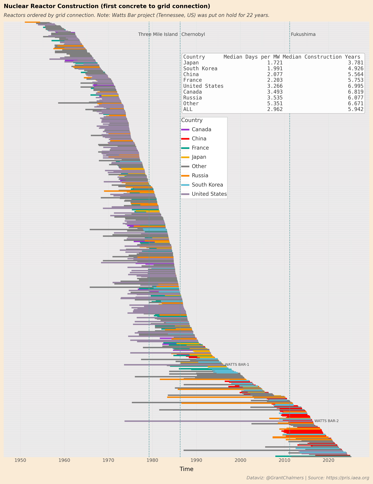

## 2025 Plotnine contest submission by Grant Chalmers.

Data for this visualisation is sourced from [The Power Reactor Information System (PRIS)](https://pris.iaea.org/pris/). The Power Reactor Information System (PRIS), developed and maintained by the International Atomic Energy Agency (IAEA) for over five decades, is a comprehensive database focusing on nuclear power plants worldwide. PRIS contains information on power reactors in operation, under construction, or those being decommissioned. All information and data items are collected by the IAEA via data providers nominated by Member States.

This visualisation shows nuclear reactor construction times from first concrete pour to grid connection. Clearly there is significant planning time before each construction starts -these statistics are not captured and hence cannot be plotted. Reactors are ordered by grid connection date. Horizontal bars (geom_segment) are coloured by countries labelled in the legend, or are grey for other. The inset table shows summary statistics such as median days per Megawatt (MW) and median construction time in years. Vertical dashed lines show historical nuclear incidents (Three Mile Island, Chernobyl, Fukushima Daiichi) and their associated impact on construction time. The chart also highlights the recent dominance of China in reactor construction.

